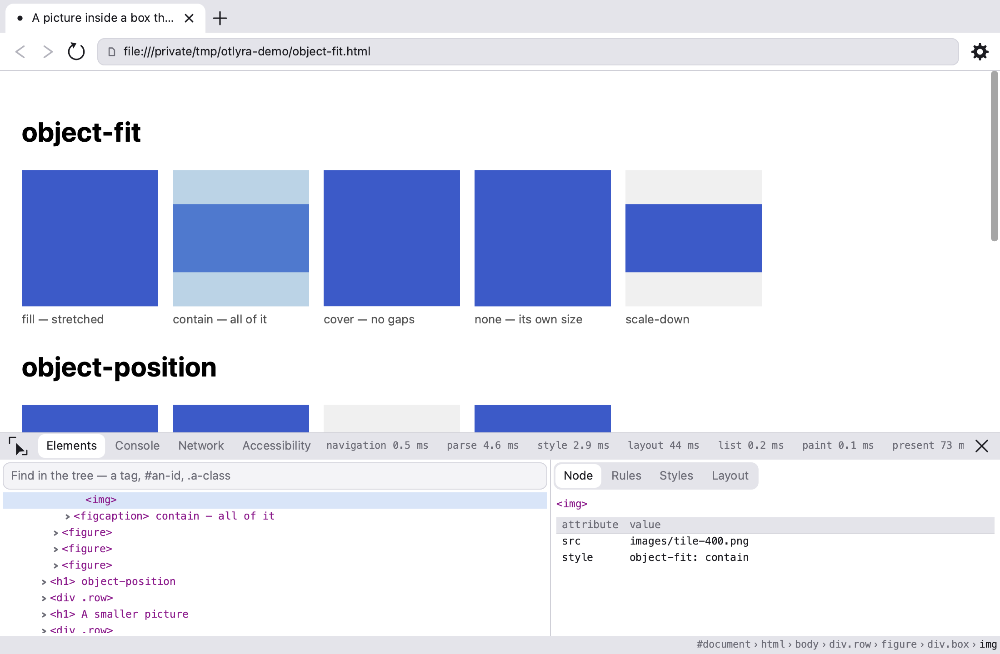

#  Otlyra

An experimental web browser, written from scratch in Rust: its own DOM, its own
cascade, its own layout, its own painting, and its own interface. Scripting is
not wired up yet, so a page is rendered the way a browser with scripting switched
off renders it — and when it is, the engine running it will be ours too:
[octofhir/otter](https://github.com/octofhir/otter), a TypeScript and JavaScript
runtime on a bytecode VM of its own, in Rust, built alongside this.

It opens pages, follows links, keeps tabs and history, and can be driven by
WebDriver BiDi or by the Model Context Protocol. Around seven hundred tests, a
conformance suite, and a comparison harness that renders the same page through
this engine and through two shipping browsers and reports the difference as a
number.



## What it renders today

**Documents.** Bytes to a DOM through the encoding rules a browser actually
follows, including a `<meta charset>` found past the prescan limit — which
decodes the document again, once. 1760 of the 1787 html5lib tree-construction
cases pass.

**Style.** A real cascade: `<style>`, `<link>`, `style=`, origins, specificity,
source order, `!important`, inheritance, `calc()`, custom properties, media
queries and `prefers-color-scheme`. Parsed sheets are kept between frames and
asked whether a new viewport changes anything, so most resizes cascade nothing.

**Layout.** Block and inline with real margin collapsing and a real inline box
model; floats and `clear`; `relative`, `absolute`, `fixed` and `sticky`;
`overflow` clipping and scrolling; flex and grid; tables with automatic column
sizing, `colspan`, `rowspan` and collapsed borders; `inline-block` on its own
baseline; `box-sizing`; percentage heights.

**Text.** Shaping, line breaking and font fallback with a browser's own answers
rather than a font library's: line heights rounded the way every engine rounds
them, a strut per paragraph, generic families resolved per platform, and a page's
own typeface through `@font-face` with WOFF and WOFF2 unpacked. White space is
processed by the CSS rules — over a whole formatting context rather than one text
node — and a tab reaches its next stop rather than taking whatever advance the
font happens to have for it.

**Paint.** A retained display list between layout and the rasterizer. Stacking
contexts and `z-index` by path, `opacity` as one composited group, `transform`
applied to the items a box drew, backgrounds with gradients and tiled pictures,
`border-radius`, `box-shadow` and `text-shadow`.

**Pictures.** Fetched, decoded and cached under a byte budget over the *decoded*
pixels. `srcset`, `sizes` and `<picture>` choose which file to ask for — by the
window's width and density, before anything is fetched — and `object-fit` decides
what happens to it inside the box it was given. A vector picture is drawn rather
than decoded.

**Around the page.** A toolbar, tab strip, settings, history and an inspector,
all built on a widget layer that paints into the same display list the page does.
Selection by drag, word, paragraph and select-all, with ⌘C. A native menu bar and
a Dock icon on macOS.

**Scripting, when it comes.** A `<script>` is parsed, counted, and not run. The
engine that will run it is [otter](https://github.com/octofhir/otter) — an
embeddable TypeScript and JavaScript runtime on its own bytecode VM and garbage
collector, ours and in Rust, so the whole browser stays one thing rather than a
renderer wrapped around somebody else's virtual machine.

## Requirements

macOS on Apple Silicon. Rust 1.96.0, pinned by `rust-toolchain.toml`. Linux is
not a goal yet.

## Running

```sh
cargo run                                    # a window, with a blank tab
cargo run -- --url example.com               # …with a page in it
cargo run -- --file page.html                # …with a local file in it
cargo run -- --screenshot frame.png          # render one frame and exit
just --list                                  # every other task
```

`--screenshot` needs no display server and exits non-zero on failure, so it is
what drives the image tests in CI.

### Looking inside

Every stage of the pipeline can be printed instead of drawn, which is how most
questions here get answered without a debugger:

```sh
cargo run -- --file page.html --dump-dom          # the parsed tree
cargo run -- --file page.html --dump-boxes        # what the cascade made of it
cargo run -- --file page.html --dump-fragments    # geometry, in logical pixels
cargo run -- --file page.html --dump-display-list out.json
cargo run -- --file page.html --dump-selectors 'ul > li:first-child'
cargo run -- --file page.html --inspector --screenshot shot.png
```

`--bidi` answers WebDriver BiDi on a loopback port; `--mcp` answers the Model
Context Protocol on stdin and stdout, so an agent can drive the browser with no
client library at all.

## How it is judged

Tests say a change did what it meant to. They cannot say the result is what a
browser would have done — so there is a second answer:

```sh
export OTLYRA_REFERENCE=…            # a browser binary to compare against
export OTLYRA_REFERENCE_ALT=…        # and a second one, from another family
just reference tests/pages/tables.html 820 1400
```

It renders the page three times and prints three numbers: this engine against
each reference, and the two references against **each other**. The third one is
the floor. Two shipping engines do not agree pixel for pixel — on a page of
nothing but text they differ by 2.8% of it — so a number near that floor is
antialiasing, and a number well above it is a bug. Where the two disagree
outright, neither is the answer and the specification is.

`tests/pages/` holds one page per feature, because a shared page hides a fault
under somebody else's. `just test-pages` lists them; `just test-page tables`
opens one, `just test-page-shot tables` writes it to a PNG, and
`just test-page-reference tables` puts it beside the references.

The harness has caught what no unit test would have: a matrix left on the canvas
that drew a scrolling panel at double size, a font collection whose bold faces
were silently dropped, sparse auto-placement in grid, and a paragraph whose
second line reported the wrong text back to a selection.

## Crates

| Crate | Owns |
|---|---|
| `otlyra-app` | The shell: navigation, tabs, history, the interface, the inspector, the automation protocols |
| `otlyra-platform` | Window, GPU surface, input. The only crate that knows what an OS is |
| `otlyra-net` | Fetching bytes, and deciding what kind of thing arrived — nothing that knows what they mean |
| `otlyra-html` | Encoding determination and the tokenizer driver: the parts a parser leaves to the browser |
| `otlyra-dom` | The document tree: a generational arena, and the only API that mutates it |
| `otlyra-css` | The cascade, computed values, and the user-agent stylesheet |
| `otlyra-layout` | The box tree, the fragment tree, and the layout that turns one into the other |
| `otlyra-text` | Font stacks, shaping, line breaking and measurement |
| `otlyra-paint` | Fragments to a display list: a pure function, and the last step before pixels |
| `otlyra-gfx` | The display list, the `PaintTarget` seam and its rasterizer backends |

Each stage is a function of the one before it, which is what makes the dumps
above possible and what keeps a scroll from laying anything out again.

Three rules hold the layering together, and tests enforce them rather than
convention:

- No windowing or GPU type appears in `otlyra-platform`'s public API, so a major
  version bump on either stays inside that crate.
- `PaintTarget` has had two backends since the first commit — a rasterizer and a
  recorder — so the choice of rasterizer stays reversible, and so a frame can be
  asserted on without pixels.
- The interface paints into a `DisplayList` exactly as the page does, never into
  a live canvas, so it is backend-independent and testable on the same seam.

## Development

```sh
just ci        # fmt, clippy, test, deny, audit, screenshot
just metrics   # cold build time, binary size, package count
just bundle    # a macOS .app you can drag to /Applications
```

`docs/interface.md` holds what binds a change to the interface and the inspector;
`docs/skia-wgpu-interop.md` records why the rasterizer and the GPU do not share a
texture, and what it would cost to make them.

Supply-chain gates need `just install-tools` once.

## Licence

Apache-2.0. Third-party licences are inventoried in `NOTICE`, generated by
`cargo about`.
